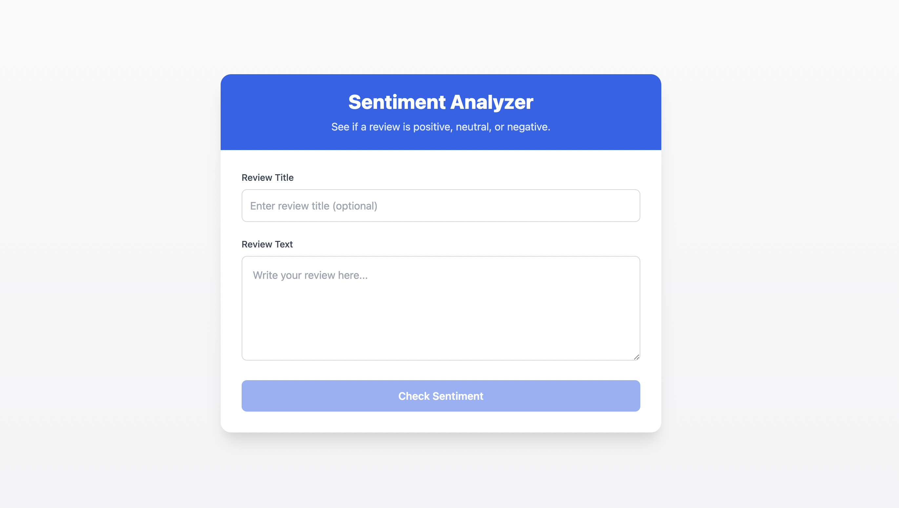
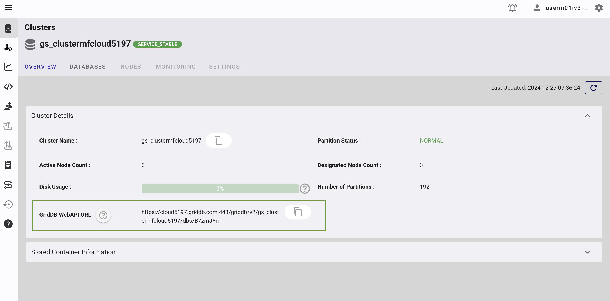
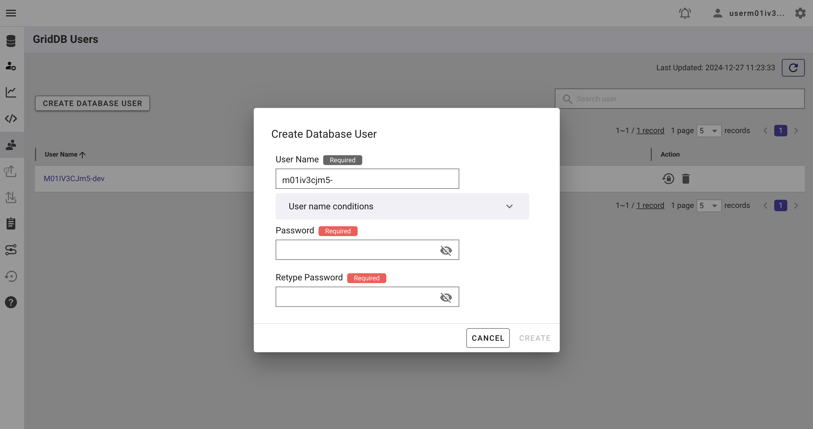
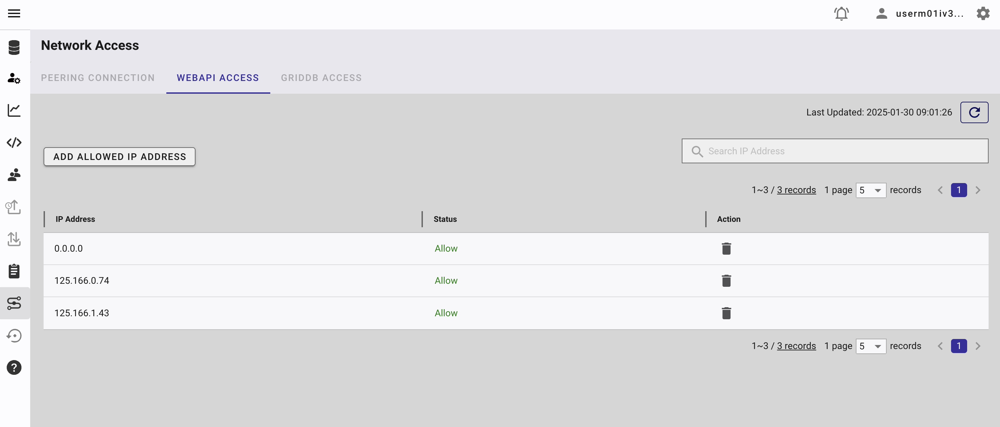
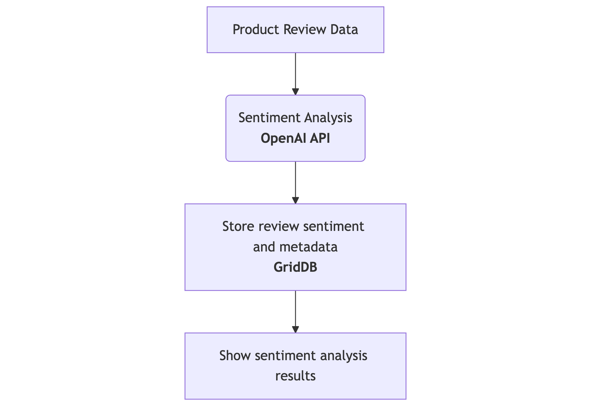
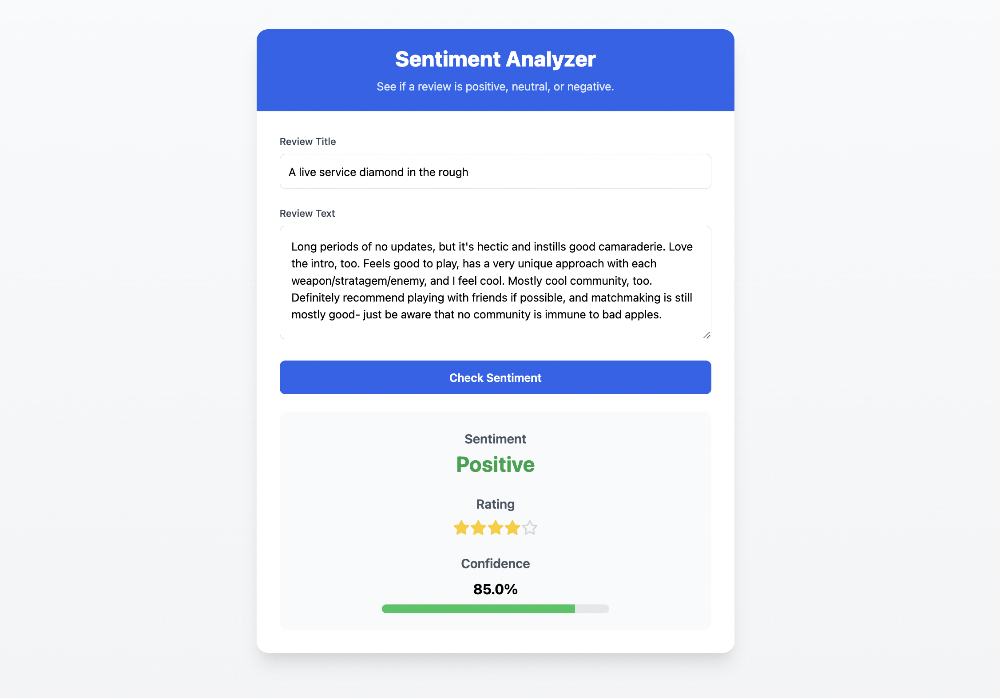

# Sentiment Analysis on Product Reviews using OpenAI


## Overview

This article explores a practical implementation of sentiment analysis on product reviews using OpenAI's large language models (LLMs) and GridDB. The project involves extracting review data, analyzing sentiment using AI, and efficiently storing and querying the results. It's an example of how modern AI tools and database systems can be combined to process and understand massive amounts of customer feedback.

## Why Use AI for Sentiment Analysis?

Manual analysis of customer sentiment is impossible at scale due to the sheer volume of user-generated content. Artificial intelligence, especially LLMs like OpenAI’s GPT, enables automated analysis with human-level language understanding. 

Key advantages include:

* **Scalability**: AI can process millions of reviews quickly and consistently.
* **Context Awareness**: LLMs are capable of identifying sarcasm, subtle opinions, and emotional tone.
* **Language Versatility**: These models handle slang, informal language, and multilingual text more effectively than rule-based systems.

AI-driven sentiment analysis helps businesses track public opinion, improve customer service, and guide product development based on real user feedback.

## Running the Project

### Clone the Repository

```bash
git clone https://github.com/junwatu/sentiment-analysis-griddb.git
cd app
npm install
```

### Setup Environment Variables

Create a `.env` file in the `app` directory of the project and add the following environment variables:

```ini
OPENAI_API_KEY=
GRIDDB_WEBAPI_URL=
GRIDDB_USERNAME=
GRIDDB_PASSWORD=
VITE_BASE_URL=http://localhost:3000
```

You can copy the `.env.example` file to `.env` and fill in the values. To get the OpenAI API key, read this [section](#openai) and for GridDB Cloud, read this [section](#griddb-cloud-setup). By default, the `VITE_BASE_URL` is set to `http://localhost:3000` but you can change it to your own domain.

### Run the Project

```bash
npm run start
```

### Access the Project

If you don't change the `VITE_BASE_URL`, open your browser and navigate to `http://localhost:3000` to access the project.



## Technologies Used

### Node.js

You need Node.js installed because this project uses [Vite](https://vite.dev/) based project. Install the Node LTS version from [here](https://nodejs.org/id/download).

### **OpenAI** 

AI models are used for natural language processing and sentiment analysis. 

Create the OpenAI API key [here](https://platform.openai.com/). You may need to create a project and enable a few models. We will use the `gpt-4o` model.

### GridDB Cloud Setup

The GridDB Cloud offers a free plan tier and is officially available worldwide.

You need these GridDB environment variables in the `.env` file:

```ini
GRIDDB_WEBAPI_URL=
GRIDDB_USERNAME=
GRIDDB_PASSWORD=
```

#### Sign Up for GridDB Cloud Free Plan

If you would like to sign up for a GridDB Cloud Free instance, you can do so in the following link: [https://form.ict-toshiba.jp/download_form_griddb_cloud_freeplan_e](https://form.ict-toshiba.jp/download_form_griddb_cloud_freeplan_e).

After successfully signing up, you will receive a free instance along with the necessary details to access the GridDB Cloud Management GUI, including the **GridDB Cloud Portal URL**, **Contract ID**, **Login**, and **Password**.

#### GridDB WebAPI URL

Go to the GridDB Cloud Portal and copy the WebAPI URL from the **Clusters** section. It should look like this:



#### GridDB Username and Password

Go to the **GridDB Users** section of the GridDB Cloud portal and create or copy the username for `GRIDDB_USERNAME`. The password is set when the user is created for the first time, use this as the `GRIDDB_PASSWORD`.



For more details, to get started with GridDB Cloud, please follow this [quick start guide](https://griddb.net/en/blog/griddb-cloud-quick-start-guide/).

#### IP Whitelist
When running this project, please ensure that the IP address where the project is running is whitelisted. Failure to do so will result in a 403 status code or forbidden access.

You can use a website like [What Is My IP Address](https://whatismyipaddress.com/) to find your public IP address.

To whitelist the IP, go to the GridDB Cloud Admin and navigate to the **Network Access** menu.



## Project Architecture



The diagram illustrates the flow of data in the sentiment analysis system:

1. Product Review Data is fed into the system.
2. The OpenAI API analyzes this data for sentiment.
3. The sentiment results and associated metadata are then stored in GridDB.
4. Finally, the sentiment analysis results are presented through a user interface.

This represents a pipeline where raw review data is processed, analyzed for sentiment, stored in GridDB, and then made available for viewing.

## Dataset Preparation

You can use any data review for this project. For example, you can use the [Amazon Review Dataset](https://cseweb.ucsd.edu/~jmcauley/datasets.html#amazon_reviews) or just copy-paste a review from one of the product reviews on Amazon.

## Server

The server is built using Node.js and Express.js. It is a simple server that provides a few API routes. You can see the server code in the `server.ts` file.

### API Routes

| Method | Endpoint | Description |
|--------|----------|-------------|
| **POST** | `/api/sentiment` | Sentiment analysis for a review and persist the result in GridDB |
| **GET** | `/api/sentiments` | Retrieve **all** stored review records |
| **GET** | `*` (any non‑API path) | Serve main UI |

## Running Sentiment Analysis with OpenAI

We use the OpenAI API (e.g., GPT-4o) to evaluate the sentiment of each review. The input is a text prompt that asks the model to categorize the sentiment.

### System Prompt

We will use a system prompt to guide the model to understand the task. The system prompt is as follows:

```shell
You are a sentiment‑analysis classifier for Amazon user‑review records. You will receive one JSON object that contains the fields "title" and "text" (and sometimes "rating" which you must ignore). Your task:\n1. Read the natural‑language content (title + text).\n2. Predict the sentiment label and an estimated star rating without looking at any numeric "rating" field.\n3. Respond ONLY with a JSON object in this schema:\n{\n  "label": "positive | neutral | negative",\n  "predicted_rating": 1 | 2 | 3 | 4 | 5,\n  "confidence": 0-1\n}\nMapping rule (aligned to the Amazon Reviews dataset):\n• 1–2 stars ⇒ negative\n• 3 stars   ⇒ neutral\n• 4–5 stars ⇒ positive\nIf the review text is empty, off‑topic, or nonsense, return:\n{"label":"neutral","predicted_rating":3,"confidence":0.0}\nNever add commentary or extra keys.
```

Basically, it tells the model to behave like a sentiment analysis classifier for Amazon user-review records.

### Few Shots

A few shots are used to guide the model in understanding the task. The few shots used in this project are as follows:

```typescript
const FEW_SHOTS = [
 {
    role: 'user',
    content: JSON.stringify({
      title: 'Rock‑solid mount',
      text:
        "I've tried dozens of phone mounts—this one finally stays put on bumpy roads. Five minutes to install and rock‑solid!",
 }),
 },
 {
    role: 'assistant',
    content: '{"label":"positive","predicted_rating":5,"confidence":0.96}',
 },
 {
    role: 'user',
    content: JSON.stringify({
      title: 'Broke in a week',
      text:
        "Looks nice, but the zipper broke after one week and Amazon wouldn't replace it.",
 }),
 },
 {
    role: 'assistant',
    content: '{"label":"negative","predicted_rating":1,"confidence":0.93}',
 },
 {
    role: 'user',
    content: JSON.stringify({
      title: 'Meh',
      text:
        'These were lightweight and soft but much too small for my liking. I would have preferred two of these together to make one loc.',
 }),
 },
 {
    role: 'assistant',
    content: '{"label":"neutral","predicted_rating":3,"confidence":0.55}',
 },
] as const;
```

Few-shot examples are used to help a model quickly learn a specific task or format by demonstrating correct input-output pairs. In this context, these few shots serve as demonstrations to guide the sentiment analysis model, illustrating:
 
- Expected input format: Reviews consisting of a title and text.

- Expected output structure: A JSON response containing:
   
   - `label`: sentiment classification ("positive", "negative", "neutral").

   - `predicted_rating`: numerical rating estimation (1–5).

   - `confidence`: confidence score for the prediction.

The model leverages these examples to understand precisely how to classify and score new reviews in a similar structured manner.

### Call OpenAI API

The sentiment analysis was done by OpenAI using the `gpt-4o` model. The code is available in the `server.ts` file. 

Here is the important code snippet:

```typescript
const completion = await openai.chat.completions.create({
    model: 'gpt-4o',
    temperature: 0,
    messages: [
 { role: 'system', content: SYSTEM_PROMPT },
 ...FEW_SHOTS,
 {
          role: 'user',
          content: JSON.stringify({ title, text }),
 },
 ],
});
```

The `text` is the review text and the `title` is the review title.

## Storing Results in GridDB

GridDB is used to persist the processed review data. We use a collection container to store the data.

### Container Schema

The container schema is as follows:

* `id`: `INTEGER`
* `title`: `STRING`
* `review`: `STRING`
* `sentiment`: `STRING`

### Saving Data to GridDB

This is the example data format that is saved to GridDB:

```json
{
  id: 4495,
  title: 'US Version',
  review: "US version of the game so DLC can't be downloaded. Returned for a refund",
  sentiment: '{"label":"negative","predicted_rating":2,"confidence":0.88}'
}
```

The `reviewData` is inserted into GridDB using the `insertData` function.

```typescript
const reviewData: GridDBData = {
    id: generateRandomID(),
    title,
    review: text,
    sentiment: JSON.stringify(parsed),
};
await dbClient.insertData({ data: reviewData });
```

The code to insert data is available in the `griddb.ts` file. Basically, this function takes the data and inserts it into GridDB using the HTTP method.

```typescript
async function insertData({
  data,
  containerName = 'sentiments',
}: {
  data: GridDBData;
  containerName?: string;
}): Promise<GridDBResponse> {
  try {
    const row = [
      parseInt(data.id.toString()),
      data.title,
      data.review,
      data.sentiment,
 ];

    const path = `/containers/${containerName}/rows`;
    return await makeRequest(path, [row], 'PUT');
 } catch (error) {
    if (error instanceof GridDBError) {
      throw error;
 }

    const errorMessage = error instanceof Error ? error.message : 'Unknown error';
    throw new GridDBError(`Failed to insert data: ${errorMessage}`, undefined, undefined, error);
 }
}
```

The API route used to insert data in GridDB Cloud is:

 ```typescript
 `${GRIDDB_WEB_API_URL}/containers/sentiments/rows`
```

and by using the HTTP PUT method, the data can be easily inserted into the database.

### Query All Data

To query all data from the `sentiments` container, you can use the following API route:

```typescript
app.get('/api/sentiments', async (req: express.Request, res: express.Response) => {
  try {
    // Search all data
    const results = await dbClient.searchData([{ type: 'sql', stmt: 'SELECT * FROM sentiments' }]);

    res.json({ data: results });
 } catch (error) {
    res.status(500).json({ error: error.message });
 }
});
```

The code above uses SQL SELECT statement to query all data from the `sentiments` container.

## User Interface

The UI is built using React and Vite. It is a simple form that allows users to input a review title and text, and then submit the form to the `/api/sentiment` endpoint. 


After submitting the form and processing the sentiment analysis, the UI receives the response data that has JSON format, for example:

```json
{
    "label": "positive",
    "predicted_rating": 4,
    "confidence": 0.85
}
```
The response data is then displayed in the UI. If the review is positive, the UI will display a green color, if it is negative, the UI will display a red color, and if it is neutral, the UI will display a yellow color. Also the UI will display the predicted rating and confidence level.



## Conclusion

This project demonstrates a real-world use case of combining AI and databases for sentiment analysis. Using OpenAI for intelligent sentiment analysis and GridDB for data storage enables fast, efficient processing of customer reviews. The same framework can be extended to other datasets and domains, including social media, customer support logs, or live feedback systems.

## References

* [GridDB Official Site](https://griddb.net/en/)
* [OpenAI API Documentation](https://platform.openai.com/docs)
* [GridDB Blog](https://griddb.net/en/blog/)
