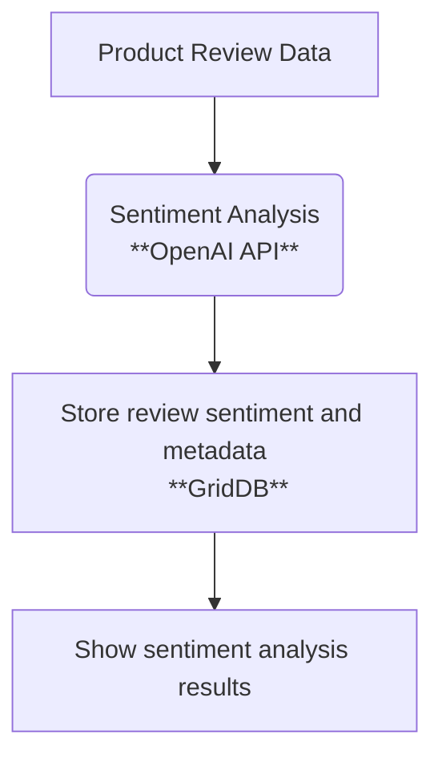

# Sentiment Analysis on Product Reviews using OpenAI


## Overview

This article explores a practical implementation of sentiment analysis on the product reviews using OpenAI's large language models (LLMs) and GridDB, a scalable time-series database. The project involves extracting review data, analyzing sentiment using AI, and efficiently storing and querying the results. It's an example of how modern AI tools and database systems can be combined to process and understand massive amounts of customer feedback.

## Why Use AI for Sentiment Analysis?

Manual analysis of customer sentiment is impossible at scale due to the sheer volume of user-generated content. Artificial intelligence, especially LLMs like OpenAI’s GPT, enables automated analysis with human-level language understanding. 

Key advantages include:

* **Scalability**: AI can process millions of reviews quickly and consistently.
* **Context Awareness**: LLMs are capable of identifying sarcasm, subtle opinions, and emotional tone.
* **Language Versatility**: These models handle slang, informal language, and multilingual text more effectively than rule-based systems.

AI-driven sentiment analysis helps businesses track public opinion, improve customer service, and guide product development based on real user feedback.

## Technologies Used

### Node.js

You need Node.js installed because this project uses Next.js. Install the Node LTS version from [here](https://nodejs.org/id/download).

### **OpenAI** 

AI models used for natural language processing and sentiment inference. 

Create the OpenAI API key [here](https://platform.openai.com/). You may need create a project and enable few models. We will use `gpt-4o` model.

### GridDB Cloud Setup

The GridDB Cloud offers a free plan tier and is officially available worldwide.

You need these GridDB environment variables in the `.env` file:

```ini
GRIDDB_WEBAPI_URL=
GRIDDB_USERNAME=
GRIDDB_PASSWORD=
```

#### Sign Up for GridDB Cloud Free Plan

If you would like to sign up for a GridDB Cloud Free instance, you can do so in the following link: [https://form.ict-toshiba.jp/download_form_griddb_cloud_freeplan_e](https://form.ict-toshiba.jp/download_form_griddb_cloud_freeplan_e).

After successfully signing up, you will receive a free instance along with the necessary details to access the GridDB Cloud Management GUI, including the **GridDB Cloud Portal URL**, **Contract ID**, **Login**, and **Password**.

#### GridDB WebAPI URL

Go to the GridDB Cloud Portal and copy the WebAPI URL from the **Clusters** section. It should look like this:


#### GridDB Username and Password

Go to the **GridDB Users** section of the GridDB Cloud portal and create or copy the username for `GRIDDB_USERNAME`. The password is set when the user is created for the first time, use this as the `GRIDDB_PASSWORD`.


For more details, to get started with GridDB Cloud, please follow this [quick start guide](https://griddb.net/en/blog/griddb-cloud-quick-start-guide/).

#### IP Whitelist
When running this project, please ensure that the IP address where the project is running is whitelisted. Failure to do so will result in a 403 status code or forbidden access.

You can use a website like [What Is My IP Address](https://whatismyipaddress.com/) to find your public IP address.

To whitelist the IP, go to the GridDB Cloud Admin and navigate to the **Network Access** menu.


## Project Architecture

In a real-world deployment, the system architecture should support high-throughput data processing, robust API interaction, and scalable storage for time-based analysis.



This architecture emphasizes modular design, where each stage is responsible for a specific function in the pipeline, promoting scalability, clarity, and maintainability.

## Dataset Preparation

The [Amazon Review Dataset](https://cseweb.ucsd.edu/~jmcauley/datasets.html#amazon_reviews) includes millions of product reviews in JSON format. Each entry typically contains:

* `reviewText` – the content of the review
* `summary` – a short title
* `overall` – numerical rating (1–5)
* `asin` – product ID
* `reviewTime` – timestamp

### Extracted Fields for Analysis

* `review_id`
* `product_id`
* `review_text`
* `review_summary`
* `rating`
* `timestamp`

These fields are preprocessed to remove irrelevant data, standardize formatting, and reduce input size for the model.

## Running Sentiment Analysis with OpenAI

We use the OpenAI API (e.g., GPT-4o) to evaluate the sentiment of each review. The input is a text prompt that asks the model to categorize the sentiment.

### Example Prompt

```
Analyze the sentiment of this review and classify it as Positive, Neutral, or Negative:

"{reviewText}"
```

### Expected Output Format

* `sentiment`: One of Positive, Neutral, or Negative
* `model_used`: Identifier for the GPT version
* `confidence`: Optional qualitative label (if included)

This output is parsed and matched with the original review metadata for downstream storage and analysis.

## Storing Results in GridDB

GridDB is used to persist the processed review data. We use a time-series container to support time-based filtering and aggregation.

### Example Container Schema

* `review_id`: string (primary key)
* `product_id`: string
* `sentiment`: string
* `rating`: float
* `timestamp`: datetime
* `model`: string

### Relevant GridDB Features

* Time-series containers for efficient time-based operations
* Composite indexes for high-speed querying
* TQL (Time-series Query Language) for flexible analytics

## Querying & Analyzing the Results

GridDB allows fast and structured access to sentiment data. Common queries include:

* Counting all negative reviews for a given product
* Comparing sentiment classification with average star rating
* Identifying temporal trends in sentiment (weekly, monthly)
* Filtering sentiment data by category or product line

### Query Example (Pseudocode)

```
SELECT COUNT(*) FROM reviews
WHERE sentiment = 'Negative' AND product_id = 'B000123XYZ'
```

Data retrieved from GridDB can be visualized in the frontend using interactive charts or exported for further analysis.

## Performance Notes & Lessons Learned

* OpenAI's rate limits require smart batching and retry logic
* GridDB performs best with bulk inserts in container-sized batches
* Reviews should be truncated to avoid exceeding model token limits
* GridDB's in-memory architecture and compression improve both read and write performance on large datasets

## Conclusion

This project demonstrates a real-world use case of combining natural language processing and time-series databases for high-volume sentiment analysis. Using OpenAI for intelligent sentiment tagging and GridDB for scalable data storage enables fast, efficient processing of customer reviews at scale. The same framework can be extended to other datasets and domains, including social media, customer support logs, or live feedback systems.

## References

* [Amazon Review Dataset – UCSD](https://cseweb.ucsd.edu/~jmcauley/datasets.html#amazon_reviews)
* [GridDB Official Site](https://griddb.net/en/)
* [OpenAI API Documentation](https://platform.openai.com/docs)
* [GridDB Blog](https://griddb.net/en/blog/)
